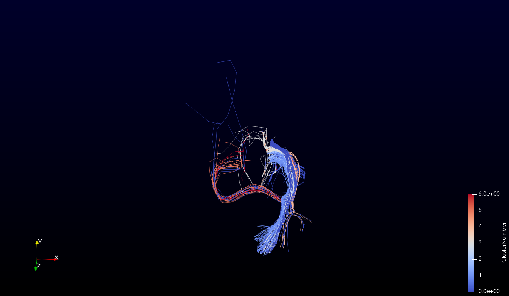
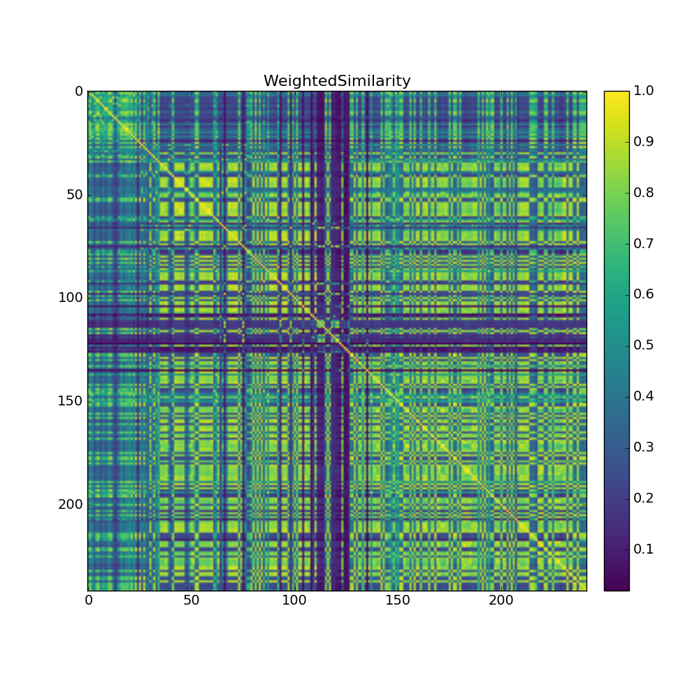
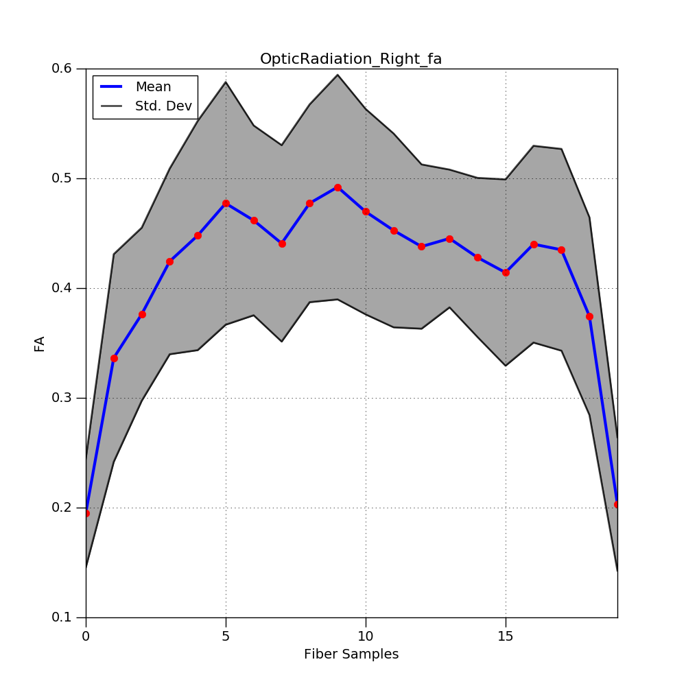

# Bundle Extraction and Evaluation Resource Documentation

The Bundle Extraction and Evaluation Resource, a data-driven tractography tool.

## Contents
* [Introduction](#introduction)
    * [Disclaimer](#disclaimer)
    * [Support and communication](#support)
* [Installation](#installation)
    * [System dependencies](#dependencies)
        * [Anaconda](#conda)
        * [Bare installation](#bare)
    * [Package installation (Python 2)](#package)
* [Running tractography tool](#runmain)
    * [Command line interface](#cli)
        * [Required arguments](#reqarg)
        * [Optional arguments](#optarg)
            * [Control arguments](#ctrlarg)
            * [Performance arguments](#prfmarg)
            * [Additional arguments](#addarg)
    * [Python library](#pylib)
* [Reported data](#report)
* [Workflow](#workflow)
* [References](#references)


## Introduction <a name="introduction"></a>
The Bundle Extraction and Evaluation Resource was developed with the aim of clustering and evaluating white matter tractography of the brain. The tool derives from the [white matter fiber clustering tool](https://github.com/SlicerDMRI/whitematteranalysis)<sup>1,2</sup>. A spectral clustering algorithm, as described by von Luxburg<sup>3</sup> (2007), is implemented to perform clustering of user-provided white matter tractography.

### Disclaimer <a name="disclaimer"></a>
This tool is still in the development stages and may undergo major changes. As such, this tool should be considered to still be in alpha stages. Results may not be correct and users should carefully check to ensure they are satisfactory.

### Support and communication <a name="support"></a>
This module has been tested on Ubuntu 16.04

All bugs, concerns, and requests for features can be requested via the github repository found [here](https://github.com/kaitj/tractography/issues).

## Installation <a name="installation"></a>
The latest development version of the bundle extraction and evaluation resource was developed on a Python 2 environment.

### System dependencies <a name="dependencies"></a>
The Bundle Extraction and Evaluation Resource requires the following dependencies:
* Joblib >= 0.10.4.dev0
* Matplotlib >= 1.5.1
* NumPy >= 1.13.1
* Scikit-learn >= 0.19.0
* SciPy >= 0.19.1
* VTK >= 6.3.0

#### Anaconda <a name="conda"></a>
The simplest option for installing all required dependencies is via Anaconda, which can be downloaded from http://continuum.io/downloads.

To install the required dependencies, run the following commands:
```
conda install joblib
conda install matplotlib
conda install numpy
conda install scipy
conda install scikit-learn
conda install vtk
```

#### Bare installation <a name="bare"></a>
If Python was not installed via Anaconda, but by another method, dependencies can be installed via [pip](https://pip.pypa.io/en/stable/installing/).

To install the majority of dependencies, the following commands should be run:
```
pip install --user joblib
pip install --user matplotlib
pip install --user numpy
pip install --user scipy
pip install --user Scikit-learn
```

VTK is not available via pip, but can be compiled with Python wrapping. During compilation, ensure VTK_WRAP_PYTHON is enabled. Ensure the correct version of Python is located during hte configuration step. Advanced mode may need to be toggled in ccmake.

For some additional information, the following links may be useful:
* http://www.vtk.org/Wiki/VTK/Building
* https://gitlab.kitware.com/vtk/vtk/blob/master/Documentation/dev/git/download.md

To be able to use the VTK library from within Python, ensure the following paths are set in either ~/.profile or ~/.bash_profile with the corresponding python version and VTK build path, similar to below:
```
export PYTHONPATH=$PYTHONPATH:/vtk/lib/:/vtk/lib/python2.7/site-packages
export LD_LIBRARY_PATH=$LD_LIBRARY_PATH:/vtk/lib
```

### Package installation (Python 2) <a name="package"></a>
To use the package's library and/or command line interface, the latest version of the the bundle extraction and evaluation resource can be downloaded from the [github repository](https://github.com/kaitj/tractography) directly or via git and installed using the following command from within the downloaded directory:

```
python setup.py install --user
```


## Running tractography tool <a name="runmain"></a>
The Bundle Extraction and Evaluation Resource can be used via command line or as a Python library to be used in Python scripts.

### Command line interface <a name="cli"></a>
Shown is an example of how to run the command line interface with required arguments.
```
Usage: clusterSingle --indir <in_dir> --subjid <subjid> --bundle <bundle_name> --outdir <out_dir>
```

#### Required arguments <a name="reqarg"></a>
```
--indir     Directory where input data set is stored
--outdir    Directory where output data will be stored
--subjid    Subject id/label
--bundle    Tractography model to cluster
```

#### Optional arguments <a name="optarg"></a>

##### Control arguments (optional) <a name="ctrlarg"></a>
```
-a          One or more scalardata files to be used in clustering
-w          One or more weights to be used for clustering data
-p          Number of samples along a fiber
-k          Number of clusters
-sig        Sigma to be used for Gaussian kernel
-sall       Flag to save all similarity matrices
-swt        Flag to save weighted similarity matrix
```

##### Performance arguments <a name="prfmarg"></a>
```
-j          Number of cores to use for computation
```

##### Additional arguments <a name="addarg"></a>
```
-v          Verbosity of tool
-h          Display help documentation
```

### Python library <a name="pylib"></a>
The Bundle Extraction and Evaluation Resource can also be imported in python and used as a python library.
To enable the use of the library in python, use the following command as part of the Python script: `import tractography`.


## Reported data <a name="report"></a>
A number of different outputs are possible depending on the inputs given. The tool can provide tract-based statistic plots, similarity matrices, as well as quantitative information applied to VTK tractography models. Seen in the screen shots below are a few examples.



<p float="left">
    
    
</p>


## Workflow <a name="workflow"></a>
To use the tool, tractography streamlines should be generated and converted to both .bfloat and .vtk format such that it can be read by Camino<sup>4</sup>.

Scalar data can be generated using the Camino command `tractstats` with the `-tractstat none` in order to generate a text file with corresponding values at each point.

A sample workflow may look similar to the one below:
```
Acquisition -> Preprocessing -> Create VTK streamlines -> Create scalar data -> Cluster with tool
```

## References <a name="references"></a>
[1] O'Donnell, LJ., and Westin, CF. Automatic tractography segmentation
using a high-dimensional white matter atlas. Medical Imaging,
IEEE Transactions on 26.11 (2007): 1562-1575.

[2] O’Donnell, LJ., Wells III, WM., Golby, AJ., Westin, CF. Unbiased groupwise registration of white matter tractography.
In International Conference on Medical Image Computing and Computer-Assisted Intervention 2012 Oct 1 (pp. 123-130).
Springer Berlin Heidelberg.

[3] Von Luxburg, U. A tutorial on spectral clustering. Statistics and computing. 2007 Dec 1. 17(4):395-416.

[4] Fowlkes, C., Belongie, S., Chung, F., Malik, J. Spectral grouping using the Nystrom method. 2004 June 28. 26(2):214-225

[5] Cook, PA, et al. Camino: open-source diffusion-mri reconstruction and processing. 14th Scientific Meeting of the International Society for Magnetic Resonance in Medicine, Seattle, WA, USA, p. 2759, May 2006.
